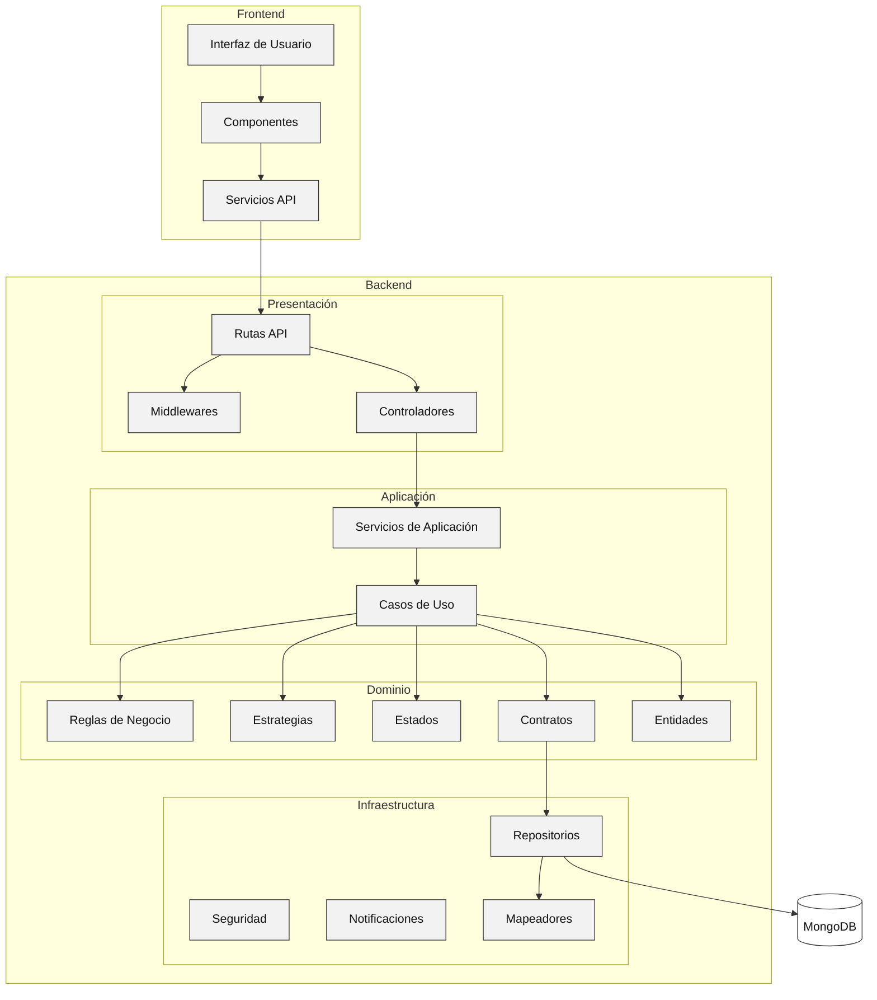
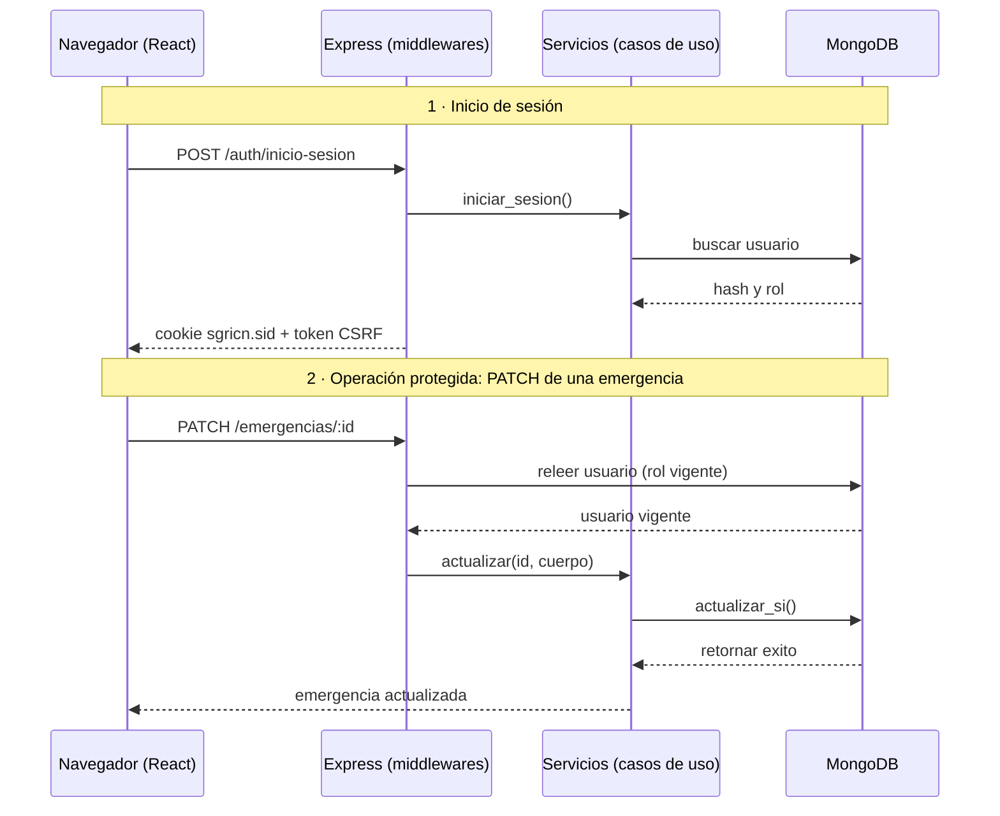
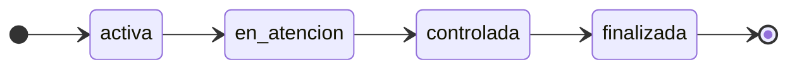

<h1 align="center">S.G.R.I.C.N</h1>
<h3 align="center">Sistema de Gestión de Recursos e Información para Catástrofes Naturales</h3>

## Descripción

Aplicación web que centraliza la información de emergencias y desastres  naturales para registrar y distribuir recursos materiales y financieros, visualizar las zonas afectadas y conocer sus necesidades, facilitando la toma de decisiones de las autoridades.

## Tabla de contenidos

1. [Descripción](#descripción)
2. [Mockups](#mockups)
3. [Características principales](#características-principales)
4. [Módulos](#módulos)
5. [Tecnologías y versiones](#tecnologías-y-versiones)
6. [Arquitectura](#arquitectura)
7. [Patrones de diseño](#patrones-de-diseño)
8. [Diagrama de secuencia](#diagrama-de-secuencia)
9. [Estructura de carpetas](#estructura-de-carpetas)
10. [Requisitos previos](#requisitos-previos)
11. [Instalación y ejecución](#instalación-y-ejecución)
12. [Recursos útiles](#recursos-útiles)
13. [Autores](#autores)

## Mockups

Los mockups de la aplicación se encuentran en Figma: [Ver mockups de SGRICN](https://www.figma.com/design/Uclsn5qFrTrcaXh5zBAePP/SGRICN?node-id=0-1&t=jPfXtD0fA7Ef1bTf-1)

## Características principales

- Registro, inicio de sesión y recuperación de contraseña por correo electrónico.
- Gestión de roles y permisos: administrador, funcionario y usuario.
- Registro, consulta, actualización y clasificación de emergencias por tipo y gravedad.
- Control del ciclo de vida de cada emergencia mediante estados válidos.
- Visualización de zonas afectadas en mapa interactivo con agrupación de marcadores y geocodificación de direcciones.
- Gestión de recursos, fondos y donaciones con seguimiento de disponibilidad y saldos.
- Registro de necesidades por zona para orientar la distribución de la ayuda.
- Dashboard con indicadores y gráficas de la situación de cada emergencia.
- Generación de reportes en PDF y envío de notificaciones por correo.
- Seguridad en el backend: cabeceras HTTP seguras, limitación de peticiones, sesiones persistentes y contraseñas cifradas.

## Módulos

| Módulo | Descripción |
| ------ | ----------- |
| Emergencias | Registro, consulta, edición, clasificación y cambio de estado de las emergencias. |
| Zonas | Registro de zonas afectadas asociadas a una emergencia y su visualización geográfica. |
| Personas afectadas | Consulta de estadísticas de la población afectada (solo estadísticas). |
| Recursos | Registro y control de recursos materiales, su ubicación y disponibilidad. |
| Fondos / Donaciones | Gestión de recursos financieros, donaciones y centros de donación. |
| Necesidades | Registro y seguimiento de las necesidades prioritarias por zona. |
| Usuarios y roles | Administración de cuentas, roles y permisos de acceso. |

## Tecnologías y versiones

### Frontend

| Tecnología | Versión / Uso |
| ---------- | ------------- |
| React | 18.0 |
| TypeScript | Tipado estático |
| Vite | 6.0 |
| React Router | 6.0 |
| CSS propio | Hojas de estilo con variables CSS |
| Chart.js | Gráficas del dashboard |
| Lucide | Iconografía |
| Inter | Tipografía |

### Mapa

| Tecnología | Uso |
| ---------- | --- |
| Leaflet | Librería de mapas interactivos |
| React-Leaflet | Integración de Leaflet con React |
| react-leaflet-cluster | Agrupación de marcadores |
| OpenStreetMap | Capa base de mapas |
| Nominatim | Geocodificación de direcciones |

### Backend

| Tecnología | Versión / Uso |
| ---------- | ------------- |
| Node.js | 20.0 o superior |
| Express | 4.0 |
| TypeScript | Modo estricto |
| express-session | Manejo de sesiones |
| connect-mongo | Almacenamiento de sesiones en MongoDB |
| Helmet | Cabeceras HTTP de seguridad |
| CORS | Control de orígenes permitidos |
| express-rate-limit | Limitación de peticiones |
| Multer | Carga de archivos |
| PDFKit | Generación de reportes en PDF |
| Nodemailer | Envío de correos electrónicos |
| bcrypt | Cifrado de contraseñas |

### Base de datos

| Tecnología | Versión |
| ---------- | ------- |
| MongoDB | Base de datos NoSQL orientada a documentos |
| Mongoose | 8.0 |

## Arquitectura

El sistema está construido con una **arquitectura por capas**, orientada a garantizar bajo acoplamiento y alta cohesión, y aplicando los **principios SOLID**.

| Capa | Responsabilidad |
| ---- | --------------- |
| Presentación | Punto de entrada al sistema y contacto con el usuario (interfaz en React y controladores HTTP). |
| Aplicación | Define las acciones del sistema, verifica permisos según el rol y emite eventos y notificaciones. |
| Dominio | Contiene las reglas de negocio y validaciones (por ejemplo, magnitudes, grupos de edad y cálculo de saldos). |
| Infraestructura | Implementación técnica: acceso a datos con Mongoose/MongoDB, cifrado, hashing de contraseñas y gestión de sesiones. |

## Diagrama de Arquitectura


## Diagrama de Secuencias


## Patrones de diseño

### Service Layer

Concentra la lógica de negocio en una capa de servicios que es consumida por los controladores. De esta forma los controladores se limitan a recibir la petición y devolver la respuesta, mientras que las reglas, validaciones y el acceso a los repositorios se gestionan desde los servicios.

### Strategy

Cada tipo de emergencia (terremoto, inundación, entre otros) requiere validaciones y cálculos de gravedad distintos. Cada tipo se implementa como una estrategia independiente, lo que permite agregar nuevos tipos sin modificar los controladores ni los servicios existentes, en cumplimiento del principio Abierto/Cerrado.

### State

Controla que las emergencias avancen únicamente por transiciones válidas, sin saltos indebidos ni ediciones manuales directas del campo estado:



## Estructura de carpetas

```
SGRICN/
├── src/                    # Backend (Node.js + Express + TypeScript)
│   ├── controllers/        # Capa de presentación: manejo de peticiones HTTP
│   ├── routes/             # Definición de rutas de la API (/api)
│   ├── services/           # Capa de aplicación: lógica de negocio (Service Layer)
│   ├── domain/             # Reglas de negocio, estrategias y estados
│   │   ├── strategies/     # Patrón Strategy por tipo de emergencia
│   │   └── states/         # Patrón State del ciclo de vida de la emergencia
│   ├── models/             # Esquemas de Mongoose
│   ├── middlewares/        # Autenticación, roles, seguridad y manejo de errores
│   ├── config/             # Configuración de base de datos, sesiones y correo
│   └── server.ts           # Punto de entrada del backend
├── frontend/               # Frontend (React + TypeScript + Vite)
│   ├── src/
│   │   ├── components/     # Componentes reutilizables
│   │   ├── pages/          # Vistas de cada módulo
│   │   ├── services/       # Consumo de la API
│   │   ├── styles/         # CSS propio con variables
│   │   └── main.tsx        # Punto de entrada del frontend
│   ├── package.json
│   └── vite.config.ts
├── package.json
├── tsconfig.json
└── README.md
```

## Requisitos previos

- Node.js 20 o superior
- npm
- MongoDB (instancia local o MongoDB Atlas)

## Instalación y ejecución

1. Instalar las dependencias e iniciar el backend desde la raíz del proyecto:

```bash
npm install
npm run dev
```

2. En otra terminal, instalar las dependencias e iniciar el frontend:

```bash
cd frontend
npm install
npm run dev
```

3. Abrir en el navegador:

```
http://localhost:5173
```

Vite redirige las peticiones a `/api` hacia el backend, que se ejecuta en el puerto `5000`.

## Recursos útiles

- [Documentación de React](https://react.dev/)
- [Documentación de Vite](https://vite.dev/)
- [Documentación de TypeScript](https://www.typescriptlang.org/docs/)
- [React Router](https://reactrouter.com/)
- [Chart.js](https://www.chartjs.org/docs/)
- [Lucide Icons](https://lucide.dev/)
- [Leaflet](https://leafletjs.com/)
- [React-Leaflet](https://react-leaflet.js.org/)
- [Nominatim](https://nominatim.org/release-docs/latest/)
- [Express](https://expressjs.com/)
- [Mongoose](https://mongoosejs.com/docs/)
- [MongoDB](https://www.mongodb.com/docs/)
- [Helmet](https://helmetjs.github.io/)
- [PDFKit](https://pdfkit.org/)
- [Nodemailer](https://nodemailer.com/)
- [Refactoring Guru - Patrones de diseño](https://refactoring.guru/es/design-patterns)

## Autores

| Nombre |
| ------ |
| Mateo Monsalve Pino |
| Nataly Iriarte Castillo |
| Jesber Nair Quinto Córdoba |
| Juan Andrés García Sepúlveda |
| María Geraldine Tequia Rivera |

Proyecto desarrollado para la asignatura Construcción de Software, Politécnico Colombiano Jaime Isaza Cadavid, 2026-2

Proyecto realizado por estudiantes para fines educativos.
