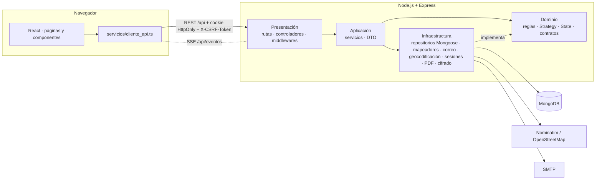
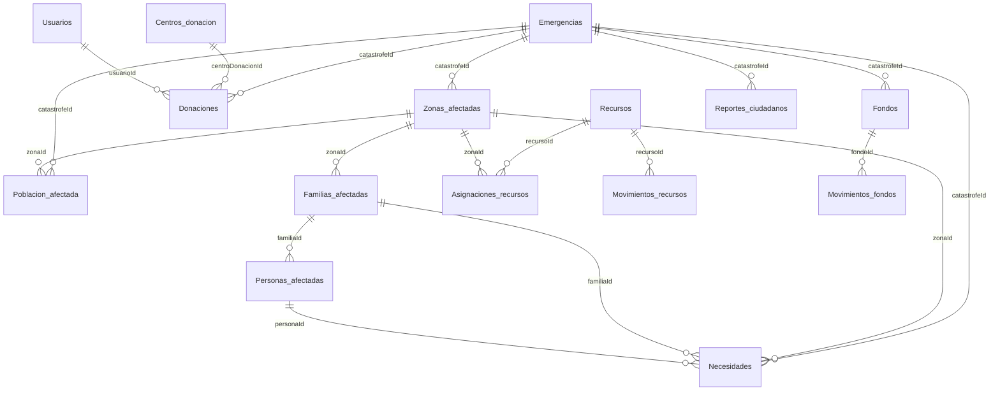

# SGRICN · Sistema de Gestión de Recursos e Información para Catástrofes Naturales

Aplicación web completa (React + TypeScript · Node.js + Express + TypeScript · MongoDB + Mongoose) para centralizar
información de emergencias, zonas y población afectadas, necesidades, recursos humanos, materiales y financieros,
donaciones y atención recibida. Proyecto académico 2026 — Politécnico Colombiano Jaime Isaza Cadavid.

> **Estado de la verificación.** Todo lo marcado «verificado» en este documento se ejecutó realmente (pruebas
> automáticas contra MongoDB y recorridos en el navegador). La conexión con la base **SGRICN de MongoDB Atlas está
> PENDIENTE**: no se dispuso de la contraseña vigente. Ver [§19 Limitaciones y pendientes](#19-limitaciones-y-configuraciones-pendientes).

## Contenido

1. [Objetivo y alcance](#1-objetivo-y-alcance)
2. [Tecnologías](#2-tecnologías)
3. [Relación con el mockup y referencias visuales](#3-relación-con-el-mockup-y-referencias-visuales)
4. [Paleta, temas y accesibilidad](#4-paleta-temas-y-accesibilidad)
5. [Arquitectura en capas](#5-arquitectura-en-capas)
6. [Estructura del proyecto](#6-estructura-del-proyecto)
7. [Instalación y ejecución](#7-instalación-y-ejecución)
8. [Variables de entorno](#8-variables-de-entorno)
9. [MongoDB, correo y geocodificación](#9-mongodb-correo-y-geocodificación)
10. [Primera cuenta privilegiada](#10-creación-segura-de-la-primera-cuenta-privilegiada)
11. [Módulos y permisos](#11-módulos-y-permisos)
12. [Modelos, relaciones y compatibilidad](#12-modelos-relaciones-y-compatibilidad-con-los-datos-existentes)
13. [Strategy y State](#13-patrones-strategy-y-state)
14. [Mapa mediante direcciones](#14-mapa-mediante-direcciones)
15. [Alertas, notificaciones y tiempo real](#15-alertas-notificaciones-y-tiempo-real)
16. [Reportes PDF](#16-reportes-pdf)
17. [Seguridad, respaldo y restauración](#17-seguridad-respaldo-y-restauración)
18. [Pruebas y rendimiento](#18-pruebas-y-rendimiento)
19. [Limitaciones y pendientes](#19-limitaciones-y-configuraciones-pendientes)

Documentación complementaria: [docs/arquitectura.md](docs/arquitectura.md) · [docs/api.md](docs/api.md) ·
[docs/trazabilidad_requisitos.md](docs/trazabilidad_requisitos.md).

---

## 1. Objetivo y alcance

SGRICN permite a funcionarios y administradores registrar y coordinar la atención de emergencias, y a los usuarios
consultar la información operativa. Incluye los requisitos RF1–RF24 y RNF1–RNF15 (ver trazabilidad), con:
autenticación con sesiones del servidor, recuperación de contraseña por correo, roles `usuario` / `funcionario` /
`administrador`, mapa por direcciones, alertas persistentes, actualización en tiempo real, reportes PDF y auditoría.

Las donaciones son **registros administrativos**: no hay integración bancaria ni confirmación automática de pagos.

## 2. Tecnologías

| Capa | Tecnología |
|---|---|
| Frontend | React 18, TypeScript estricto, Vite 6, React Router 6, CSS propio con variables, Chart.js, Lucide (iconos), Inter |
| Mapa | Leaflet + react-leaflet, agrupación con react-leaflet-cluster, teselas de OpenStreetMap, geocodificación Nominatim (desde el backend) |
| Backend | Node.js ≥ 20, Express 4, TypeScript estricto, express-session + connect-mongo, helmet, CORS, express-rate-limit, multer, PDFKit, Nodemailer |
| Base de datos | MongoDB con Mongoose 8 (sólo el backend se conecta) |
| Contraseñas | bcrypt (compatible con hashes `$2a$`, `$2b$`, `$2y$`) |
| Calidad | ESLint 10 + typescript-eslint, Prettier, `tsc --noEmit`, Vitest, Supertest, Testing Library, autocannon |

## 3. Relación con el mockup y referencias visuales

El mockup entregado (20 pantallas) es la referencia principal. Se reprodujeron:

- **Estructura**: barra lateral oscura con los grupos *Centro de control*, *Gestión de crisis*, *Recursos y logística*,
  *Informes y análisis*, *Administración* y el pie *Ayuda y configuración*; insignia de rol; barra superior con título,
  buscador `⌘K/Ctrl K`, indicador «Sincronizado», campana con contador y menú de usuario (perfil, modo oscuro, cerrar sesión).
- **Patrón de página**: migas → etiqueta de sección → título grande → descripción → chips «Filtrar por» → tarjeta
  principal + **«Panel de control»** lateral.
- **Pantallas**: Centro de mando (tarjetas KPI, gráfico por tipo y mes, «Estado y acciones», «Abrir prioridad»),
  Emergencias (resumen + tabla con insignias), Registrar/editar/clasificar emergencia (errores de validación,
  completitud, «Guardar y confirmar», «Guardar borrador»), Detalle de emergencia (mapa, panel, Exportar PDF, Compartir),
  Mapa de zonas (capas, leyenda, zona seleccionada), Zona afectada (estados de atención en chips, «Guardar zona»),
  Personas afectadas, Necesidades prioritarias (contadores, tarjetas por prioridad, «Actualizar necesidad»),
  Inventario (aviso de insuficiencia, bodegas activas, leyenda), Registrar recurso/actualizar disponibilidad
  (Solicitado/Disponible/Déficit), Asignación y distribución (resumen antes de confirmar), Fondos financieros (totales,
  movimientos, «Registrar movimiento» con validación de saldo), Centro de alertas, Usuarios/roles/permisos, Mi perfil,
  Configuración, Ayuda y Equipo de desarrollo.

**Diferencias intencionales (impuestas por los requisitos):**

| Mockup | Implementación | Motivo |
|---|---|---|
| Azul marino y azul `#1F6FB2` | Paleta obligatoria (`#5CB3C5`, `#287687`, `#F2B705`, `#DA0325`, `#595959`, `#F2F2F2`) | Sección 3 |
| Roles «Coordinador», «Funcionario financiero», «Usuario autorizado» | Exactamente `usuario`, `funcionario`, `administrador` | Sección 6 |
| Mapa con «coordenadas inválidas» | «Pendientes de ubicación» (nunca se piden ni muestran coordenadas) | Sección 14 |
| «Personas afectadas» con nombres visibles para todos | Módulo restringido a funcionario/administrador; el rol usuario sólo ve estadísticas | Sección 6 y RF15 |
| «Modificar perfil» por cualquier usuario | Perfil de sólo lectura; cambio de contraseña por enlace al correo | El rol usuario sólo hace operaciones de su propia autenticación |
| «Next.js» en Equipo de desarrollo | Tecnologías realmente usadas | Veracidad |

**Interacciones de CodePen adaptadas a componentes React** (sin copiar código; se reimplementó la idea):

- *Card Hover Interactions* (hexagoncircle) y *Magic Card* (gayane-gasparyan) → `TarjetaIndicador`: elevación al pasar
  o enfocar y brillo radial que sigue al puntero. Toda la información es visible sin cursor.
- *Barra lateral desplegable* (azouaoui-med) → `BarraLateral`: grupos plegables con `aria-expanded`, modo compacto
  sólo con iconos y menú deslizante en celulares.
- *Dashboard* (themustafaomar) → `PaginaDashboard` + `GraficoEmergencias` (Chart.js) con tabla equivalente accesible.
- *Alertas y notificaciones* (codysechelski) → `ContextoAvisos` + `PilaAvisos` sin jQuery: éxito, información,
  advertencia y error; cierre accesible; los errores importantes permanecen hasta cerrarse.

## 4. Paleta, temas y accesibilidad

Las variables obligatorias están en [frontend/src/estilos/tokens.css](frontend/src/estilos/tokens.css), con derivados
para texto sobre fondos suaves y el modo oscuro. **Contraste medido** con
`node frontend/scripts/verificar_contraste.mjs` (38 pares, todos cumplen; las transparencias se componen sobre su
fondo real antes de medir):

| Par | Contraste |
|---|---|
| Texto `#595959` sobre blanco / sobre `#F2F2F2` | 7.00:1 / 6.26:1 |
| Blanco sobre botón primario `#287687` | 5.21:1 |
| Texto `#6B4E00` sobre advertencia suave · texto `#A8001B` sobre peligro suave | 6.99:1 · 6.56:1 |
| Texto oscuro `#2E2A1E` sobre amarillo `#F2B705` | 7.88:1 |
| Celeste `#5CB3C5` sobre barra lateral `#22313A` | 5.55:1 |
| Series del gráfico y marcadores del mapa (elementos gráficos, mínimo 3:1) | 3.24:1 a 10.39:1 |

`#5CB3C5` sobre blanco sólo alcanza 2.41:1: por eso nunca se usa como texto sobre blanco. El rojo se reserva para
situaciones críticas y acciones destructivas. Los estados siempre llevan **texto + icono** (`Insignia`).

Accesibilidad aplicada: foco visible, enlace «Saltar al contenido», navegación por teclado (atajo `Ctrl/⌘ K`, flechas
en el buscador, modales con foco atrapado y `Escape`), regiones vivas (`role="status"` / `role="alert"`), errores junto
al campo y en un resumen, tablas con `caption`, `scope` y `aria-sort`, gráfico con tabla equivalente, `prefers-reduced-motion`
y opción manual «Reducir animaciones», modo claro/oscuro guardado en el navegador, diseño responsive (computador,
tablet y celular; en celular las tablas se muestran como tarjetas).

## 5. Arquitectura en capas



- El **dominio** no importa Express, Mongoose ni React; contiene catálogos, reglas, validador, Strategy, State y contratos.
- Los **servicios de aplicación** usan contratos (repositorios, correo, geocodificador, cifrador, PDF) que la
  **infraestructura** implementa; la **composición** ([backend/src/composicion/contenedor.ts](backend/src/composicion/contenedor.ts))
  conecta todo con inyección sencilla.
- Las consultas MongoDB sólo ocurren en repositorios; los documentos se traducen con **mapeadores explícitos**.
- El frontend reutiliza el mismo dominio (alias `@dominio`) para validar con exactamente las mismas reglas.

Detalle completo, diagramas de secuencia y decisiones: [docs/arquitectura.md](docs/arquitectura.md).

## 6. Estructura del proyecto

```text
SGRICN/
├── backend/
│   ├── src/
│   │   ├── dominio/            Reglas puras: catálogos, permisos, validador, esquemas, Strategy, State, contratos
│   │   │   ├── estrategias/    IEstrategiaEmergencia, EstrategiaTerremoto, EstrategiaInundacion, EstrategiaGeneral, GestorEmergencia
│   │   │   ├── estados/        IEstadoEmergencia, EstadoActiva…EstadoFinalizada, estados de atención de zonas
│   │   │   ├── reglas/         magnitud, permisos, población, prioridad de zona, recursos y fondos, contraseña, ubicación
│   │   │   ├── validacion/     validador declarativo y esquemas por operación
│   │   │   └── contratos/      interfaces de repositorios y servicios externos
│   │   ├── aplicacion/         Casos de uso (servicios) y DTO; ServicioEntidad genérico + servicios especializados
│   │   ├── infraestructura/    Mongoose (modelos, repositorios, mapeadores), correo, geocodificación, sesiones, PDF, cifrado, evidencias, eventos
│   │   ├── presentacion/       Rutas, controladores y middlewares (autenticación, CSRF, límites, errores)
│   │   ├── configuracion/      Lectura y validación de variables de entorno (sin imprimir secretos)
│   │   ├── composicion/        Raíz de composición (inyección de dependencias)
│   │   ├── aplicacion_express.ts   Construye la app Express (reutilizada por las pruebas)
│   │   └── servidor.ts         Punto de entrada
│   ├── pruebas/                Pruebas de dominio e integración (Vitest + Supertest) y resultados de carga
│   ├── scripts/                Inspección, promoción de cuenta, índices, importación, respaldo, restauración y carga
│   └── .env.example
├── frontend/
│   ├── src/
│   │   ├── componentes/        alertas · formularios · tablas · mapas · navegacion · tarjetas
│   │   ├── paginas/            Páginas por módulo
│   │   ├── servicios/          Único acceso HTTP (cliente_api + servicios por entidad)
│   │   ├── contextos/          Sesión e inactividad, tema, avisos, tiempo real (SSE)
│   │   ├── hooks/              useConsulta, useOperacion, useFormularioEntidad, useParametrosUrl
│   │   ├── validadores/        Validación de formularios con el dominio compartido
│   │   ├── estilos/            tokens.css (paleta y temas), base.css, componentes.css
│   │   ├── tipos/ · utilidades/ · pruebas/
│   ├── scripts/verificar_contraste.mjs
│   └── .env.example
├── docs/                       arquitectura.md · api.md · trazabilidad_requisitos.md
├── .gitignore
└── README.md
```

## 7. Instalación y ejecución

Requisitos: Node.js 20 o superior (probado con 24.21), npm y acceso a MongoDB.

```bash
cd backend
npm install
cp .env.example .env        # en Windows: copy .env.example .env
```

Edita `backend/.env` (ver §8): escribe la contraseña vigente en `MONGODB_URI` y genera `SECRETO_SESION` y
`CLAVE_CIFRADO_DATOS`. Luego, **antes de usar la aplicación con la base real**, inspecciona la estructura (sólo lectura):

```bash
npm run inspeccionar-base -- --salida ../docs/inspeccion_base.json
```

Inicia el backend:

```bash
npm run dev
```

En otra terminal, el frontend:

```bash
cd frontend
npm install
npm run dev
```

Abre http://localhost:5173 (Vite redirige `/api` al backend en el puerto 5000).

Producción: `npm run compilar` en ambos proyectos; luego en el backend `SERVIR_FRONTEND=true NODE_ENV=production npm run inicio`
(sirve `frontend/dist` en el mismo origen) detrás de un proxy **HTTPS** (las cookies usan `Secure` en producción).

| Script (backend) | Uso |
|---|---|
| `npm run dev` / `compilar` / `inicio` | Desarrollo, compilación y producción |
| `npm run tipos` / `lint` / `pruebas` | Comprobación de tipos, ESLint y pruebas |
| `npm run inspeccionar-base` | Informe de sólo lectura de colecciones, tipos, relaciones, estados y duplicados |
| `npm run promover-administrador` | Primera cuenta privilegiada (§10) |
| `npm run crear-indices` | Migración separada de índices (revisa duplicados; `--aplicar` para ejecutar) |
| `npm run importar-emergencias` | Importación validada con Strategy (simulación por defecto; `--aplicar`) |
| `npm run respaldar` / `restaurar` | Respaldo lógico y restauración verificada en base aislada |
| `npm run prueba-carga` | Prueba de rendimiento sobre base aislada |

Frontend: `npm run dev`, `compilar`, `tipos`, `lint`, `pruebas`, `vista-previa`.

## 8. Variables de entorno

Todas las variables del backend están documentadas en [backend/.env.example](backend/.env.example) (sin secretos).
Las más importantes:

| Variable | Descripción |
|---|---|
| `MONGODB_URI` | `mongodb+srv://admin_sgricn:<CONTRASENA_NUEVA>@sgricn.m7en36h.mongodb.net/?appName=SGRICN` — reemplaza el marcador por la credencial **vigente** (la compartida anteriormente debe rotarse). Si el marcador sigue presente, el servidor no arranca. |
| `MONGODB_DB` | `SGRICN` (se selecciona explícitamente con `dbName`) |
| `MONGODB_URI_PRUEBAS` / `MONGODB_DB_PRUEBAS` | Base aislada para pruebas automáticas (debe terminar en `_pruebas`) |
| `SECRETO_SESION` | ≥ 32 caracteres aleatorios |
| `CLAVE_CIFRADO_DATOS` | 32 bytes en base64 (AES-256-GCM). **Si se pierde, los datos cifrados no se pueden recuperar**: guárdala en un gestor de secretos y no la cambies sin migrar los datos. |
| `SESION_INACTIVIDAD_MINUTOS` | 5 (RNF12) |
| `CORS_ORIGENES`, `URL_FRONTEND` | Orígenes permitidos y URL usada en el enlace de recuperación |
| `SMTP_*`, `CORREO_REMITENTE` | Proveedor de correo |
| `GEOCODIFICACION_*` | URL de Nominatim, correo de contacto e intervalo entre solicitudes |

El frontend sólo tiene `VITE_PROXY_API` ([frontend/.env.example](frontend/.env.example)); nunca recibe la URI ni credenciales.

## 9. MongoDB, correo y geocodificación

**MongoDB.** Las colecciones tienen nombres explícitos ([nombres_colecciones.ts](backend/src/infraestructura/persistencia/nombres_colecciones.ts)).
El sistema **no borra, renombra, sobrescribe ni siembra** datos: no existe ningún *seed*. Al iniciar sólo crea índices en
colecciones **nuevas** (idempotencia, deduplicación de alertas, tokens); los índices de colecciones heredadas (correo único
en `Usuarios`) se aplican con `npm run crear-indices -- --aplicar` después de revisar duplicados. Si la conexión falla,
el proceso termina con un mensaje claro (sin datos simulados y sin mostrar la URI).

**Correo.** Configura `SMTP_HOST`, `SMTP_PUERTO`, `SMTP_SEGURO`, `SMTP_USUARIO`, `SMTP_CONTRASENA`. Si no está
configurado, la recuperación responde igual de forma genérica, la interfaz indica «Envío no verificado» y el servidor
registra la advertencia; **nunca se simula una entrega exitosa**.

**Geocodificación.** Nominatim/OpenStreetMap desde el backend, respetando su política: máximo 1 solicitud por segundo
(cola), identificación por `User-Agent` (configura `GEOCODIFICACION_CORREO_CONTACTO` con un correo institucional del
proyecto), caché de 24 h, límite de 30 búsquedas por minuto por usuario y consultas sólo al pulsar «Buscar dirección».
Las teselas son de `tile.openstreetmap.org` con atribución visible; para uso intensivo en producción se recomienda un
proveedor de teselas propio o contratado.

## 10. Creación segura de la primera cuenta privilegiada

No hay contraseñas predeterminadas ni cuentas sembradas.

1. La persona se registra en la aplicación (`/registro`): queda con rol `usuario`.
2. Alguien con acceso al servidor y a `backend/.env` ejecuta (primero sin `--confirmar` para ver la simulación):

   ```bash
   npm run promover-administrador -- --correo persona@entidad.gov.co --rol administrador --confirmar
   ```

3. El cambio queda en `Auditoria`. Desde ese momento los roles se gestionan en **Usuarios y roles**.

## 11. Módulos y permisos

| Acción | usuario | funcionario | administrador |
|---|:-:|:-:|:-:|
| Consultar información operativa, mapa y dashboard; exportar lo que puede consultar | Sí | Sí | Sí |
| Crear, editar y eliminar registros operativos; cambiar estados | No | Sí | Sí |
| Gestionar recursos, asignaciones, fondos, donaciones, centros y reportes ciudadanos | No | Sí | Sí |
| Administrar cuentas, roles y estados | No | Sí | Sí |
| Datos personales restringidos (personas, familias, donantes, evidencias, teléfonos) | No | Sí | Sí |

- La matriz está en [backend/src/dominio/reglas/permisos.ts](backend/src/dominio/reglas/permisos.ts) y se comprueba
  **en cada ruta y en cada servicio** (401 sin sesión, 403 sin permiso). Ocultar botones en React es sólo comodidad.
- Nadie otorga un rol superior al propio ni gestiona cuentas de rango superior; nadie cambia su propio rol o estado.
- El usuario se relee de MongoDB en cada solicitud: un **cambio de rol o una desactivación** se aplican de inmediato;
  la desactivación además elimina sus sesiones.
- El rol `usuario` sólo realiza operaciones de su autenticación (registro, inicio y cierre de sesión, recuperación),
  cambia su tema y marca sus notificaciones como leídas.

Módulos: Dashboard · Mapa · Emergencias · Zonas · Población (estadísticas) · Personas y familias · Necesidades ·
Reportes ciudadanos · Inventario · Asignaciones · Recursos humanos · Fondos y donaciones · Centros de donación ·
Reportes PDF · Alertas · Usuarios y roles · Perfil · Configuración · Ayuda · Equipo.
Endpoints completos: [docs/api.md](docs/api.md).

## 12. Modelos, relaciones y compatibilidad con los datos existentes



Colecciones **heredadas** (se conservan nombres y campos): `Usuarios`, `Emergencias`, `Zonas_afectadas`,
`Poblacion_afectada`, `Necesidades`, `Centros_donacion`, `Donaciones`. Campos **nuevos** añadidos sin tocar los
existentes: `magnitud`, `ubicacion`, `clasificacion` (emergencias); `prioridad`, `estadoAtencion`, `danos`, `ubicacion`
(zonas); `adolescentes` (población, opcional); `ambito`, `zonaId`, `familiaId`, `personaId`, `responsable` (necesidades).
Colecciones **nuevas**: `Personas_afectadas`, `Familias_afectadas`, `Recursos`, `Movimientos_recursos`,
`Asignaciones_recursos`, `Recursos_humanos`, `Fondos`, `Movimientos_fondos`, `Reportes_ciudadanos`,
`Historial_estados`, `Alertas`, `Lecturas_alertas`, `Auditoria`, `Tokens_recuperacion`, `Sesiones`.

**Capa de compatibilidad (sin convertir datos):**

- *Identificadores*: `_id`, `catastrofeId`, `zonaId`, `usuarioId` pueden ser ObjectId o texto (`"cat001"`). Las consultas
  buscan ambas representaciones ([identificadores.ts](backend/src/infraestructura/persistencia/identificadores.ts));
  las referencias nuevas se guardan con el tipo del registro referenciado.
- *Fechas*: pueden estar como texto ISO o como BSON Date. Se leen ambas, los filtros por rango comparan ambas
  representaciones y los registros nuevos se guardan como Date. Al editar sólo se escriben los campos que cambiaron.
- *Nombres*: los [mapeadores](backend/src/infraestructura/persistencia/mapeadores/definiciones.ts) traducen
  `fechaInicio` ↔ `fecha_inicio`, etc. El hash `password` nunca pasa por el mapeador.
- *Estados heredados*: `en_proceso` → en atención, `cerrada` → finalizada, etc. (ver
  [catalogos.ts](backend/src/dominio/reglas/catalogos.ts)). Se interpretan para mostrar y decidir transiciones, **no se
  migran**. Valores desconocidos se muestran como «no reconocido» y bloquean transiciones hasta revisarlos.
- *Terremotos sin magnitud*: se marcan «pendiente de validación»; no se inventa la magnitud ni se eliminan.
- *Zonas sin estado de atención*: se interpretan como «sin atender» sin escribir en la base.

**Integridad al eliminar** (política «restringir»): no se elimina un registro con dependencias (por ejemplo, una
emergencia con zonas, población, necesidades, donaciones, fondos, asignaciones o reportes) y se responde 409
explicando la causa. Recursos y fondos con movimientos se **inactivan/cierran** en lugar de eliminarse; las
asignaciones se **anulan**; las donaciones confirmadas se **anulan**; las cuentas se **desactivan**.

**Migraciones**: no hay migraciones automáticas. La única migración revisable es `scripts/crear_indices.ts`.

## 13. Patrones Strategy y State

**Strategy** ([backend/src/dominio/estrategias](backend/src/dominio/estrategias)): `GestorEmergencia` elige
`EstrategiaTerremoto` (terremoto/sismo), `EstrategiaInundacion` (inundación y avenida torrencial) o
`EstrategiaGeneral`. Cada estrategia **prepara, valida y clasifica**. Se usa en: creación, PUT, PATCH (sobre los datos
combinados guardados + cambios, así que un cambio de tipo o una edición parcial también se validan), importación y en
el formulario del navegador (la misma clase).

- Terremoto: magnitud obligatoria, finita y **≥ 5.0** — «Para registrar una emergencia de terremoto, la magnitud debe
  ser mayor o igual a 5.0.» (regla funcional de SGRICN). Clasificación sugerida: 5.0–5.9 medio, 6.0–6.9 alto, ≥ 7 crítico.
- Inundación: nivel alto o crítico exige dirección o referencia del sector (planeación de evacuaciones).
- Los demás tipos descartan la magnitud.

**State** ([backend/src/dominio/estados](backend/src/dominio/estados)): `EstadoActiva → EstadoEnAtencion →
EstadoControlada → EstadoFinalizada`. `EstadoFinalizada.al_entrar()` fija `fechaFin`. El campo `estado` **no existe** en
los esquemas de PUT/PATCH, por lo que sólo cambia con `POST /api/emergencias/:id/transiciones`, que:
comprueba el permiso, aplica la transición, **actualiza sólo si el estado almacenado sigue siendo el leído**
(concurrencia), registra historial (usuario, fecha, anterior, nuevo, observación), audita y genera la alerta.
Las zonas tienen su propio ciclo de atención (`sin_atender`, `en_atencion`, `atendida_parcialmente`,
`atendida_completamente`) con tabla de transiciones e historial.

## 14. Mapa mediante direcciones

Formularios con país, departamento, municipio, barrio y dirección (nunca latitud/longitud). Flujo:
**escribir dirección → «Buscar dirección» → el backend consulta Nominatim → coincidencias → elegir → marcador → ajustar
(arrastrar o «Señalar en el mapa») → «Confirmar ubicación» → guardar → al volver se muestra la misma dirección y
ubicación**. Las coincidencias que sólo ubican el barrio o el municipio se marcan «Aproximada».

- Si la dirección cambia, la ubicación anterior pasa a **pendiente** (en la interfaz y también en el servidor, que
  compara la dirección confirmada con la actual) y deja de dibujarse en el mapa general.
- Sin resultados: mensaje claro, opción de corregir o señalar el lugar, o guardar como **pendiente de ubicación** (sin
  punto inventado). Fallo del proveedor: 502 con la misma orientación.
- Mapa general: datos reales de la API, capas emergencias/zonas/centros con iconos y leyenda, agrupación de
  marcadores, ajuste de vista, filtros por capa, departamento, municipio, nivel y estado sincronizados con el listado y
  la URL, ventana con título, dirección, estado, nivel, afectación, necesidades y enlace al detalle, actualización
  automática por SSE, lista de pendientes de ubicación. Las áreas sólo se dibujan si existe `geometria` con
  `geometriaValidada: true` (relleno translúcido y contorno definido).

## 15. Alertas, notificaciones y tiempo real

- **Avisos de interfaz** (`PilaAvisos`): éxito sólo tras la respuesta del backend; errores persistentes; texto seguro.
- **Alertas persistentes** (`Alertas` + `Lecturas_alertas`): nueva emergencia, caso crítico, zona sin atención (al crear
  con prioridad alta/crítica y verificación periódica cada 15 min de zonas sin atender por más de 24 h), recurso
  insuficiente o agotado, cambios de estado, asignaciones y entregas, necesidades críticas y reportes ciudadanos.
  Con destinatarios por rol, responsable, registro relacionado, fecha, entrega y lectura por usuario, y clave de
  deduplicación. Un usuario desconectado las recibe al volver a iniciar sesión.
- **Tiempo real (RNF3)**: Server-Sent Events en `/api/eventos`; cada cambio publica `{entidad, accion}` filtrado por rol y
  las pantallas afectadas vuelven a consultar. El canal no renueva la inactividad y se cierra si la sesión expira o la
  cuenta se desactiva.
- **Inactividad (RNF12)**: 5 minutos en el servidor (las consultas automáticas no la renuevan) y aviso en la interfaz
  60 s antes con «Seguir conectado».

## 16. Reportes PDF

`GET /api/reportes-pdf?categorias=emergencias,zonas,…&catastrofe_id=&departamento=&municipio=&desde=&hasta=` genera con
PDFKit un documento con título, fecha, autor, filtros, una tabla por categoría y «Página X de Y». Si no hay resultados lo
indica. El rol `usuario` no recibe datos de donantes; las personas individuales nunca forman parte de los reportes.
Volumen documentado: hasta 2.000 filas por categoría.

## 17. Seguridad, respaldo y restauración

- Contraseñas con bcrypt (costo 12); política de 8–72 caracteres con letra y número; nunca se devuelven hashes ni tokens.
- Sesiones en MongoDB (`Sesiones`), cookie `sgricn.sid` HttpOnly, SameSite=Lax, Secure en producción, caducidad
  absoluta 8 h e inactividad 5 min; regeneración de sesión al iniciar (anti fijación).
- CSRF con token sincronizador (`X-CSRF-Token`); CORS restringido a `CORS_ORIGENES`; Helmet con CSP.
- Límites: 10 inicios de sesión y 5 recuperaciones por 15 min por IP; 30 geocodificaciones y 10 PDF por minuto por usuario.
- Recuperación: token de 32 bytes, se guarda sólo su SHA-256 y vencimiento (30 min), un solo uso atómico, respuesta
  genérica, invalida tokens y sesiones anteriores.
- **Cifrado (RNF5)**: AES-256-GCM para documento, condiciones de vulnerabilidad y observaciones de personas; clave en
  `CLAVE_CIFRADO_DATOS` fuera del código y de la base.
- Validación de entrada con esquemas que **rechazan campos no permitidos**; consultas construidas sólo con campos
  permitidos (los parámetros no textuales se descartan, por lo que no se pueden inyectar operadores MongoDB).
- Errores centralizados en español sin detalles internos; los registros ocultan credenciales de URIs.
- Evidencias: JPG/PNG/PDF ≤ 5 MB validados por su firma binaria, guardados fuera de carpetas públicas y descargables sólo
  por personal autorizado.
- HTTPS: obligatorio en producción mediante proxy inverso (no incluido).

**Respaldo y restauración (RNF14)**: `npm run respaldar` exporta todas las colecciones (excepto `Sesiones`) en Extended
JSON comprimido con manifiesto y aplica retención (`RESPALDO_RETENCION_DIAS`, 14 por defecto). Periodicidad recomendada:
diaria a las 03:00 con el Programador de tareas de Windows o cron, por ejemplo
`0 3 * * * cd /ruta/backend && npm run respaldar`. `npm run restaurar -- --origen <carpeta> --destino <base_aislada>`
restaura y compara las cantidades con el manifiesto; se niega a escribir sobre la base de producción. **Los respaldos
contienen datos personales y hashes: guárdalos cifrados y con acceso restringido.** La programación automática **no
está activada** por este proyecto (ver §19).

## 18. Pruebas y rendimiento

| Suite | Resultado |
|---|---|
| Backend · dominio (Strategy, State, reglas) | **28/28** ✔ |
| Backend · autenticación y recuperación (MongoDB `SGRICN_pruebas`) | **14/14** ✔ |
| Backend · permisos, CRUD, terremotos, transiciones, integridad, ubicación, compatibilidad | **28/28** ✔ |
| Backend · recursos, concurrencia, fondos, alertas, verificación de zonas desatendidas, SSE, PDF | **17/17** ✔ |
| **Total backend** | **87/87** ✔ |
| Frontend · validación compartida y accesibilidad (Vitest + Testing Library) | **9/9** ✔ |
| ESLint + `tsc --noEmit` (backend, pruebas, scripts y frontend) | Sin errores ✔ |
| Contraste WCAG (38 pares) | Todos cumplen ✔ |

Recorrido de extremo a extremo en el navegador (base local aislada `SGRICN_demo_pruebas`), detallado en
[docs/trazabilidad_requisitos.md](docs/trazabilidad_requisitos.md): registro → hash bcrypt verificado en MongoDB →
promoción por script → inicio de sesión → terremoto 4.9 rechazado y 5.2 aceptado → búsqueda real en Nominatim (5
coincidencias aproximadas) → confirmar marcador → guardar → reinicio del backend → misma dirección y ubicación →
transición con historial → cambio de dirección (pendiente) → nueva búsqueda y confirmación → rol usuario con 403 en
escrituras → PDF → respaldo y restauración verificados → móvil y modo claro/oscuro.

**Rendimiento** (`npm run prueba-carga`; resultado en [backend/pruebas/resultados/prueba_carga.json](backend/pruebas/resultados/prueba_carga.json)).
Entorno: portátil Windows 11, Intel Core i5‑1035G1 (8 hilos), 8 GB RAM, Node 24.21, MongoDB local; backend en un
proceso y generador de carga en otro del mismo equipo. Volumen: 2.000 emergencias, 1.000 zonas, 500 cuentas.

| Medida | Resultado | Requisito |
|---|---|---|
| Usuarios conectados (sesión + canal SSE abierto) | 500 | RNF4: 500 |
| Carga concurrente: 100 conexiones durante 20 s, mezcla de listados, dashboard, mapa, alertas, zonas y recursos | 3.482 solicitudes, 100 % HTTP 200, 0 errores, p50 501 ms, p99 1.421 ms, máx. 1.734 ms | RNF1: ≤ 3 s |
| Consultas individuales con la carga SSE activa | p95 entre 4 y 22 ms (mapa 20 ms); primera consulta en frío p95 950 ms | RNF1 |
| 30 asignaciones simultáneas | máx. 964 ms | RNF2: ≤ 5 s |
| Propagación SSE | 30.000/30.000 eventos recibidos (60 eventos × 500 usuarios) | RNF3 |
| PDF de 3.000 filas | 1.106 ms (236 KB) | RNF15: ≤ 10 s |

«Usuarios conectados» ≠ «solicitudes concurrentes»: 500 personas con sesión abierta y 100 conexiones enviando
solicitudes sin pausa (carga más exigente que el uso típico). Dependencias externas que afectan tiempos: Nominatim (1 s
entre solicitudes) y el proveedor SMTP. Los resultados son de este equipo; en Atlas y otro servidor deben repetirse.

## 19. Limitaciones y configuraciones pendientes

| Pendiente | Motivo / acción |
|---|---|
| **Conexión, inspección y lectura de la base SGRICN en Atlas** | No se dispuso de la contraseña vigente (el DNS SRV y el puerto 27017 de Atlas sí respondieron). Escribe la credencial en `backend/.env`, ejecuta `npm run inspeccionar-base` y revisa el informe antes de usar la aplicación; si los nombres de colección o campos difieren, ajusta `nombres_colecciones.ts` y `mapeadores/definiciones.ts`. Hasta entonces, la compatibilidad se basa en la estructura de referencia y en las pruebas con datos heredados simulados en la base de pruebas. |
| Envío real de correos | No hay SMTP configurado: el envío **no está verificado**. Las pruebas usan un transporte en memoria. |
| Respaldos periódicos activos | El script existe y se verificó; la programación (cron/Programador de tareas) debe crearla el administrador del servidor. |
| HTTPS y despliegue | Requiere proxy inverso con certificado. |
| Varias instancias del backend | El bus SSE y la caché de consultas son en memoria; con varias instancias usar Change Streams de MongoDB o Redis. |
| Rendimiento en el entorno final | Las cifras corresponden al portátil de pruebas con MongoDB local. |
| Transacciones | Las operaciones críticas usan actualizaciones atómicas condicionadas; si el proceso se detiene entre dos escrituras puede quedar un movimiento en estado `procesando` (no afecta saldos y no se muestra). Con un *replica set* (Atlas) puede migrarse a transacciones. |
| Proyecto anterior | La carpeta `SGRICN/SGRICN` contiene una versión previa con datos semilla y contraseñas predeterminadas; no forma parte de esta entrega y se recomienda eliminarla. |
