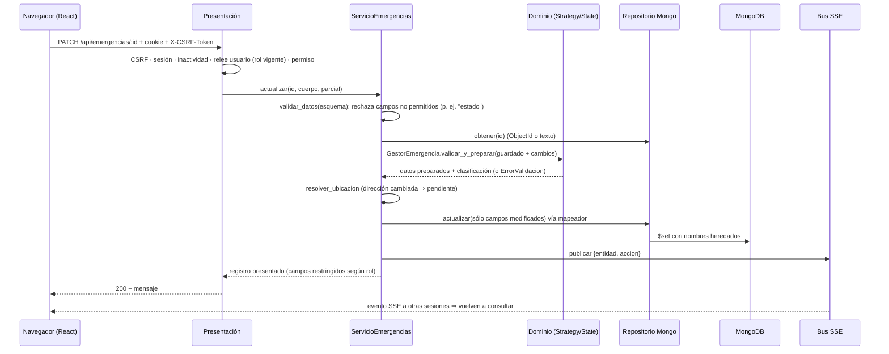
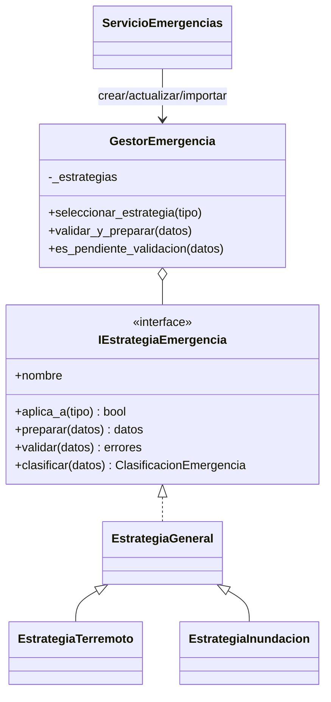
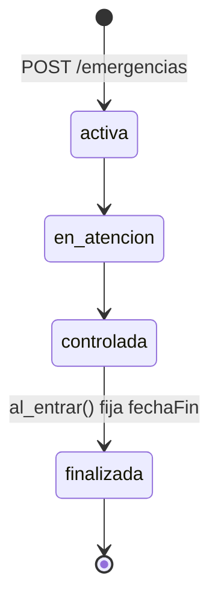

# Arquitectura de SGRICN

## 1. Capas y dependencias

| Capa | Carpeta | Responsabilidad | Puede depender de |
|---|---|---|---|
| Presentación | `backend/src/presentacion` | Rutas, controladores (HTTP ⇄ servicios), middlewares: autenticación e inactividad, permisos, CSRF, límites, errores | Aplicación, Dominio |
| Aplicación | `backend/src/aplicacion` | Casos de uso: `ServicioEntidad` (CRUD genérico con validación, relaciones, permisos por campo, integridad, auditoría y eventos) y servicios especializados (emergencias, zonas, recursos, asignaciones, fondos, cuentas, autenticación, alertas, tablero, mapa, PDF) | Dominio (contratos) |
| Dominio | `backend/src/dominio` | Catálogos, matriz de permisos, validador y esquemas, reglas (magnitud, población, prioridad, saldos, contraseña, ubicación), Strategy, State, contratos y errores | Nada externo |
| Infraestructura | `backend/src/infraestructura` | Modelos Mongoose, repositorios, mapeadores, correo SMTP, Nominatim, sesiones en MongoDB, PDFKit, AES-GCM, bcrypt, almacén de evidencias, bus de eventos | Dominio (implementa contratos) |
| Composición | `backend/src/composicion/contenedor.ts` | Crea las implementaciones concretas e inyecta dependencias | Todas |

El dominio no importa Express, Mongoose, Node ni React (los bytes se representan con `Uint8Array`), por eso el
frontend lo reutiliza con el alias `@dominio`: el formulario de emergencias usa **la misma clase** `GestorEmergencia`.

## 2. Flujo de una operación

## 3. Patrón Strategy

## 4. Patrón State

`transicionar_emergencia()` obtiene el objeto estado (`EstadoActiva`, …) del valor almacenado (con equivalencias
heredadas documentadas), pregunta `puede_transicionar_a()` y aplica `al_entrar()`. El servicio persiste con
`actualizar_si(id, [estado == leído])`: si otra persona cambió el estado entre la lectura y la escritura, responde 409.

Atención de zonas (tabla de transiciones): `sin_atender → en_atencion → atendida_parcialmente ⇄ en_atencion →
atendida_completamente → en_atencion (reapertura)`.

## 5. Concurrencia e idempotencia

| Operación | Mecanismo |
|---|---|
| Asignar recursos | Movimiento/asignación con `claveIdempotencia` única → `findOneAndUpdate({_id, estado:'activo', cantidadDisponible ≥ n}, {$inc})`. Si no hay existencias se elimina el borrador y se responde 409. Prueba: 15 solicitudes simultáneas sobre 10 unidades ⇒ 10 aceptadas, 5 rechazadas. |
| Entregas y devoluciones | `cantidadPendiente ≥ n` en la asignación, en la misma operación atómica |
| Fondos | Invariante `montoDisponible = asignado − comprometido − gastado` mantenido con `$inc` condicionado; ejecutar un compromiso lo marca `vigente → ejecutado` de forma atómica (no se ejecuta dos veces). Prueba: 5 compromisos simultáneos de 300 sobre 1.000 ⇒ 3 aceptados. |
| Equipos humanos | `disponibilidad == disponible` al asignar |
| Estados | Actualización condicionada por el estado leído |
| Tokens de recuperación | `findOneAndUpdate({tokenHash, usadoEn:null, venceEn > ahora})` |
| Alertas | Índice único por `claveDeduplicacion` |

## 6. Decisiones de diseño

- **ServicioEntidad genérico** con *hooks* (`aplicar_reglas`, `enriquecer`, `despues_de_guardar`, `antes_de_eliminar`)
  para no duplicar validación, relaciones, permisos, auditoría, integridad y eventos en cada módulo.
- **Mapeadores explícitos** API (snake_case) ⇄ base (nombres heredados); el hash de contraseña nunca se mapea.
- **Sólo se escriben los campos que cambian** en una edición: los valores heredados (fechas como texto, ids como texto)
  no se convierten en silencio.
- **Caché de 5 s** para mapa e indicadores, vaciada en cuanto se publica cualquier cambio (no muestra datos viejos).
- **SSE** en lugar de WebSocket: comunicación servidor→cliente suficiente, reconexión automática del navegador y uso
  de la misma cookie de sesión.
- **Sesiones en MongoDB** con `touchAfter` de 60 s y la inactividad controlada por la aplicación, no por la cookie.

## 7. Contraste

Ver la tabla en el README (§4) y el script `frontend/scripts/verificar_contraste.mjs`, que compone las transparencias
sobre su fondo real antes de medir y falla si algún par no cumple.
